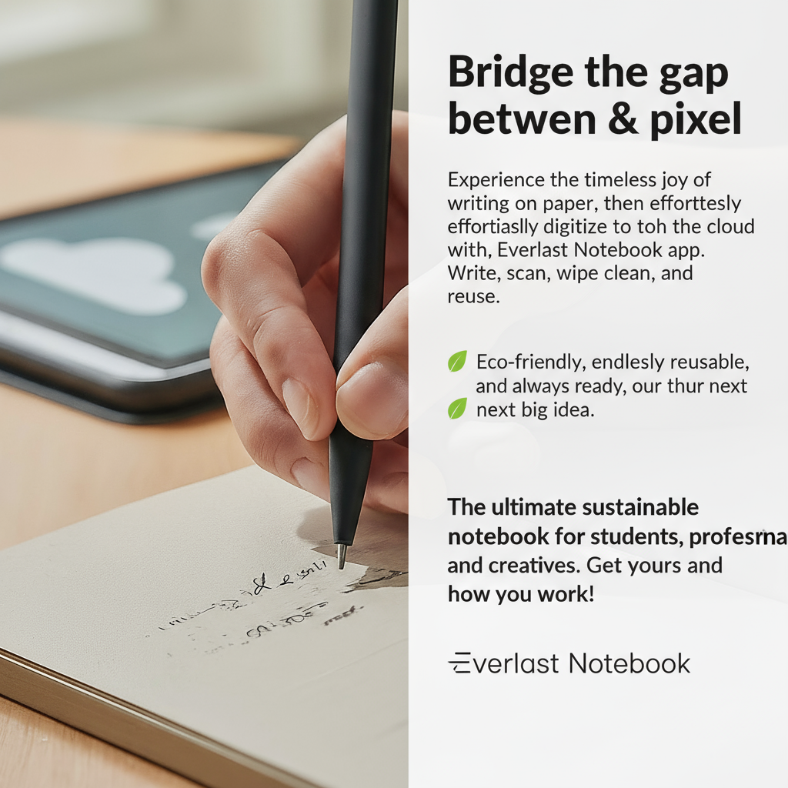

# DevFest DC AI Challenge - Dynamic Ad Creative Generation Agent

A multi-agent AI system for automated digital ad creative generation using Google's Agent Development Kit (ADK) and Vertex AI.

## 🎯 Project Overview

This project creates an AI-powered system that automates the creation of digital ad creatives by orchestrating multiple specialized agents. The system takes a product description and target audience as input and generates both ad copy and visual creatives for different platforms.

## Examples
### ADK UI


### Ad

## 🏗️ Architecture

The project uses a **hybrid approach** combining:
- **Google ADK** for agent orchestration and communication
- **Vertex AI Imagen** for image generation  
- **Gemini 2.5 Flash** for text generation and multimodal processing
- **Streamlit** for the user interface

### Agent Structure

Our multi-agent system consists of:

1. **Root Agent** - Main orchestrator that coordinates the workflow
2. **Copy Generator Agent** - Generates persuasive ad copy
3. **Image Generator Agent** - Creates base images using Vertex AI Imagen
4. **Ad Composer Agent** - Combines copy and images into complete ad creatives

## 🚀 Features

- **Multi-Platform Support**: Generates ads optimized for Facebook, Google, and TikTok
- **Automated Workflow**: End-to-end generation from brief to final creative
- **Visual Intelligence**: Platform-aware image generation with appropriate framing and composition
- **Interactive UI**: Streamlit-based interface for easy interaction
- **Downloadable Assets**: Generated ads and JSON exports

## 📁 Project Structure

```
DevFestDC-AI-Challenge/
├── ad_creative_agent/          # Main agent system
│   ├── agent.py               # Root orchestrator agent
│   └── sub_agents/            # Specialized sub-agents
│       ├── copy_generator/    # Ad copy generation
│       ├── image_generator/   # Image creation
│       └── ad_composer/       # Creative composition
├── streamlit_app.py           # Web interface
├── ads/                       # Final composed ad creatives
├── images/                    # Generated base images
├── image_generation_VertexAI.py  # Vertex AI integration
└── README.md                  # Project documentation
```

## 🛠️ Setup & Installation

### Prerequisites

- Python 3.8+
- Google Cloud Project with Vertex AI enabled
- Google AI Studio API key

### Environment Setup

1. Clone the repository:
```bash
git clone https://github.com/your-username/DevFestDC-AI-Challenge.git
cd DevFestDC-AI-Challenge
```

2. Install dependencies:
```bash
pip install google-adk
pip install streamlit
```

3. Set up environment variables in `.env`:
```bash
GEMINI_API_KEY=your_gemini_api_key
GCP_PROJECT_ID=your_gcp_project_id
GCP_LOCATION=us-central1
GOOGLE_CLOUD_PROJECT=your_gcp_project_id
GOOGLE_CLOUD_LOCATION=global
GOOGLE_GENAI_USE_VERTEXAI=True
```

4. Authenticate with Google Cloud:
```bash
gcloud auth application-default login
```

## 🎮 Usage

### Streamlit Web Interface

Launch the interactive web application:

```bash
streamlit run streamlit_app.py
```

1. Enter your **product description**
2. Specify your **target audience**
3. Select your **marketing goal** (Awareness, Consideration, Conversion)
4. Click **Generate Ads** to create 3 variations per platform
5. Download individual images or the complete ads JSON

### ADK Web Interface (Local Testing)

Test the agent system using ADK's built-in web interface:

```bash
adk web
```

This provides a local web interface to interact directly with your agents for development and testing.

### Agent System Integration

Use the ADK agents directly in your code:

```python
from ad_creative_agent.agent import root_agent

# Initialize the root agent
response = root_agent.send_message(
    "Generate ad copy and images for a fitness tracker targeting young professionals"
)
```

## 🔧 Core Technologies

- **[Google Agent Development Kit (ADK)](https://cloud.google.com/vertex-ai/generative-ai/docs/agent-development-kit)** - Agent framework
- **[Vertex AI Imagen](https://cloud.google.com/vertex-ai/generative-ai/docs/image/overview)** - Image generation
- **[Gemini 2.5 Flash](https://ai.google.dev/gemini-api)** - Language model for copy generation
- **[Streamlit](https://streamlit.io/)** - Web interface
- **[Pillow (PIL)](https://pillow.readthedocs.io/)** - Image processing

## 📋 Implementation Status

### ✅ Completed Features
- Multi-agent system using Google ADK
- Ad copy generation
- Vertex AI Imagen integration for image generation
- Platform-aware visual prompt engineering
- Streamlit web interface
- Image composition and text overlay
- Downloadable assets

### 🚧 Planned Features (From Original Blueprint)
- LangGraph workflow orchestration
- Advanced evaluator agent with quality scoring
- Analytics agent with performance insights
- Feedback loop for iterative improvement
- A/B testing capabilities

## 🤝 Contributing

This project was developed for the DevFest DC AI Challenge. Feel free to fork and extend the functionality!

## 🙏 Acknowledgments

- DevFest DC organizers for the AI Challenge
- Google Cloud for Vertex AI and ADK platform
- The open-source community for supporting libraries
