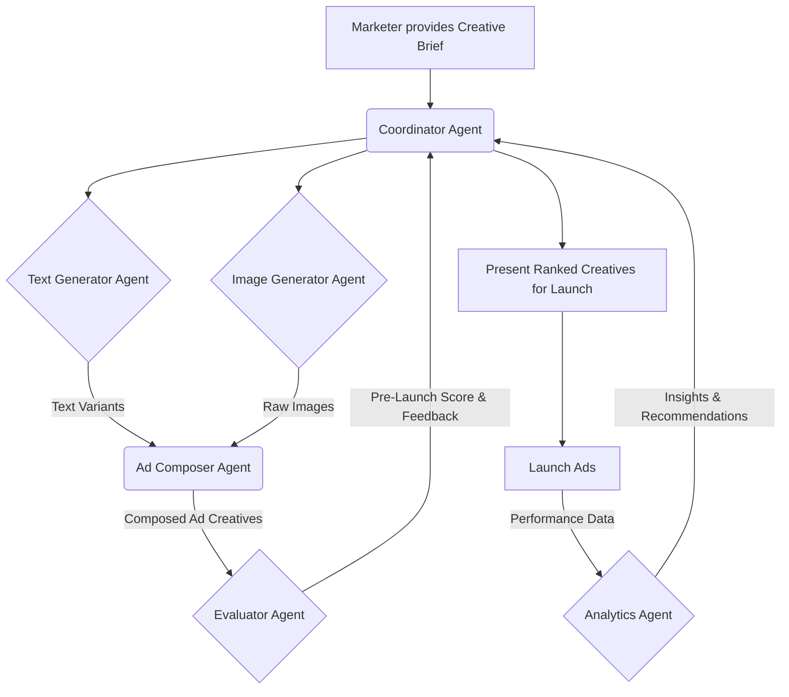

# Project Overview: Dynamic Ad Creative Generation Agent

## Project Mission

To design an autonomous, multi-agent system that automates the time-consuming process of creating, testing, and optimizing digital ad creatives. The system aims to save marketing teams significant time and resources while improving return on ad spend (ROAS) through rapid, data-driven iteration.

---

## Core Concept

The system operates as a **controlled feedback loop**, mimicking the workflow of an expert marketing team. It takes a high-level creative brief and manages the entire lifecycle of an ad creative: from initial generation and composition to pre-launch evaluation and post-launch performance analysis.

The process is iterative but not an infinite loop; it is a human-in-the-loop system where a marketer approves the initial campaign launch based on the agents' creative outputs, and then initiates future cycles based on performance recommendations. For the hackathon, the system will focus on generating **digital image ads**.

---

## The Agent Team

Our solution is composed of a team of six specialized AI agents, each with a distinct role:

1.  **Coordinator Agent 🧠:** The orchestrator and project manager. It directs the workflow, manages state, and delegates tasks to the other agents.
2.  **Text Generator Agent ✍️:** The prompt engineering strategist. It acts as an expert copywriter by translating the high-level creative brief into multiple, distinct prompts to generate a wide variety of strategic ad copy (headlines, body text, CTAs).
3.  **Image Generator Agent 🎨:** The visual prompt engineer. It acts as a creative director by translating the campaign's goals into multiple, descriptive prompts to generate a wide range of raw images in different styles (e.g., lifestyle, product-focused).
4.  **Ad Composer Agent ✂️:** The graphic designer. It takes the raw text and images and intelligently combines them, handling resizing, formatting, and text placement to create complete, platform-ready ad creatives.
5.  **Evaluator Agent 🧐:** The pre-launch quality assurance expert. It performs a qualitative analysis of the composed ads, scoring them on criteria like clarity, engagement, and alignment with the brief.
6.  **Analytics Agent 📊:** The post-launch data analyst. It ingests and interprets quantitative performance data (mocked for the hackathon) to identify winning creatives and provide actionable insights for future iterations.

---

## The Workflow

The system follows a logical, cyclical path to ensure continuous improvement.

1.  **Initiation:** A marketer provides a **Creative Brief**.
2.  **Generation:** The **Coordinator** tasks the **Text** and **Image Generator** agents to create the raw assets in parallel.
3.  **Composition:** The **Ad Composer Agent** receives the assets and assembles them into complete, polished ad creatives.
4.  **Evaluation:** The **Evaluator Agent** scores the creatives, providing a pre-launch quality check.
5.  **Launch:** The **Coordinator** presents the top-ranked creatives to the marketer for approval to launch.
6.  **Analysis:** Post-launch, the **Analytics Agent** processes performance data to find what works.
7.  **Iteration:** The insights are fed back to the **Coordinator**, ready to inform the next generation cycle upon the marketer's request.